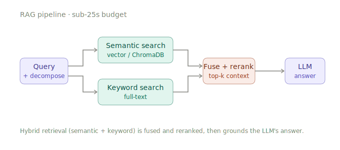

<h1 align="center">Hi, I'm Akshay 👋</h1>

<p align="center">
  
</p>

---

> Computer Engineering @ The University of Hong Kong · quant, ML, and hardware, in roughly that order on a good day

Indian by passport, raised across Dubai and Oman, now building things in Hong Kong. I am a Computer Engineering undergraduate at HKU on a full-tuition scholarship, working where **quantitative finance, machine learning, and hardware** overlap. I am drawn to problems that refuse to stay in one discipline, and I am slowly building toward the one project that ties all three together: a computer from scratch, from a Verilog CPU up to an ML accelerator.

Research assistant by day, aspiring quant by night, reformed distro-hopper at all hours.

<br />

<table>
<tr>
<td width="33%" valign="top">

**Hardware**

```verilog
module akshay (
  input  clk,
  output reg silicon
);
  // Altium PCBs, VESC
  // shields, FPGAs, and a
  // plan to build a CPU
  // from the gates up.
  always @(posedge clk)
    silicon <= 1'b1;
endmodule
```

</td>
<td width="33%" valign="top">

**Quant**

```python
def edge(signals):
    # 6 alphas, HMM regimes,
    # Black-Litterman + HRP,
    # VaR/CVaR. Built right,
    # whatever the PnL did.
    return optimise(
        blend(signals)
    )
```

</td>
<td width="33%" valign="top">

**ML / AI**

```python
def answer(query):
    # hybrid retrieval, LLM
    # rerank, generate; under
    # a hard latency budget.
    hits = semantic(query) \
         + keyword(query)
    ctx = rerank(hits)[:k]
    return generate(query,
                    ctx)
```

</td>
</tr>
</table>

---

### 🛠️ What I actually work on

**Quantitative & computational finance**
Multi-signal alpha engines with three-state HMM regime detection, Black-Litterman and Hierarchical Risk Parity portfolio optimisation, and VaR/CVaR risk management; plus discounted-cash-flow and probability-weighted valuation work. Mostly crypto, often over windows short enough that the results are noise more than signal, all of it engineered properly regardless of what the PnL did. Incoming Summer Analyst at **Caerus Global Management** via the Asia Quant Academy programme.

Portfolios in that work are scored against a single composite objective, weighting downside-adjusted, total, and drawdown-adjusted return:

$$\text{Score} = 0.4 \cdot \text{Sortino} + 0.3 \cdot \text{Sharpe} + 0.3 \cdot \text{Calmar}$$

where each ratio compares excess return $(R_p - R_f)$ against a different notion of risk:

$$\text{Sharpe} = \frac{R_p - R_f}{\sigma_p} \qquad \text{Sortino} = \frac{R_p - R_f}{\sigma_d} \qquad \text{Calmar} = \frac{R_p - R_f}{\lvert \text{MDD} \rvert}$$

with $\sigma_p$ the total volatility, $\sigma_d$ the downside deviation, and $\text{MDD}$ the maximum drawdown.

**Machine learning & AI systems**
Retrieval-augmented generation done with intent: LLM reranking, query decomposition, hybrid keyword-and-semantic retrieval, and latency budgets that actually hold under load. Multi-agent systems, computer vision with YOLO, and an old soft spot for computational chemistry (I once solved the hydrogen atom from first principles and rendered the orbitals in Blender).

<p align="center">
  <picture>
    <source media="(prefers-color-scheme: dark)" srcset="assets/rag-pipeline-dark.svg" />
    
  </picture>
</p>

**Hardware & electronics**
Buck and boost converters, VESC shields, and PCB design in Altium; the FPGA and computer-architecture half of the degree; soldering, with the small burn hole in one finger to show for it. The long game is the build-it-all-from-silicon project that makes the other two tracks honest:

```text
   ┌─────────────────────────────────────────────┐
   │  ML accelerator         (GPU / systolic array)│
   ├─────────────────────────────────────────────┤
   │  OS  ·  scheduler  ·  memory management       │
   ├─────────────────────────────────────────────┤
   │  ISA  ·  assembler  ·  toolchain              │
   ├─────────────────────────────────────────────┤
   │  CPU  ·  ALU  ·  registers     (Verilog/VHDL) │
   ├─────────────────────────────────────────────┤
   │  logic gates  ·  silicon       (first floor)  │
   └─────────────────────────────────────────────┘
            building upward, one layer at a time
```

---

### ⚡ Currently

- **Research Assistant @ HKU InnoWing**: an advanced RAG system over the InnoWings knowledge base, and a multi-agent moot-court simulator for law students (now growing a voice interface)
- Co-authoring a paper on **AI in urban planning**, grown out of a coursework methodology that turned out to be thorough enough to publish
- Four active research assistantships across LLMs, DFT simulation, and more, with publications as the goal
- Getting genuinely, properly good at C++, the one language I dodged for too long

### 🏅 A few things along the way

- One of 36 nationally selected for the **Research Science Initiative** at IIT Madras; one of 50 internationally for **Columbia's Roaring Cubs Collective** (published there on AI road-damage detection)
- **Top 10 / 105+ teams** at the HKU Web3 Quant Trading Hackathon · semi-finalist at Venture Capital On Campus and Alibaba JumpStarter ZPIRE
- International Research Olympiad 2025, Global Rank 191
- AI Trainee at **RAICOM** and Electronics Team at **ROBOCON** at HKU, because someone has to keep both halves of "Computer Engineering" busy

---

### 🧰 Toolbox


---

<p align="center"><i>"Your right is to action alone, never to its fruits; let not the fruits of action be your motive."</i><br/>Bhagavad Gita, 2.47</p>

---

### 🔗 Find me

<p align="left">
  <a href="https://www.linkedin.com/in/akshaytp-b8a50a243/">
    
  </a>
  <a href="mailto:akshaytp@connect.hku.hk">
    
  </a>
</p>

> Repos to be pinned and linked soon. A fair amount of the work above currently lives in collaborators' repositories.
